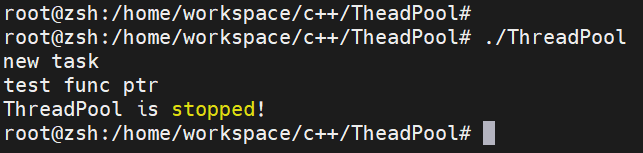

# ThreadPool

## Introduce
- Implement a simple ThreadPool using c++11   
（使用c++11实现简单的线程池） 
- Use Makefile and CMake to manage project  
（使用MakeFile和CMake管理项目）
- Dynamically shared libraries  
（使用动态共享库）


## Use posture
### Project Strcuture

ThreadPool :  

- ThreadPool.h 
- ThreadPool.cpp 
- main.cpp 
- Makefile
- CMakeLists.txt
- test
	- test.h
	- test.cpp
	- CMakeFile.txt
	- MakeFile
- utils 
	- util.h
	- util.cpp
	- CMakeFile.txt
	- MakeFile

### Procedure
```
git clone https://github.com/zKris2/ThreadPool.git
```

utils/
```
cmake .
make
```

ThreadPool/
```
cmake .
make
```

test/
```
cmake .
make
./test_threadpool_so
```

## Version Record
### First version

A simple ThreadPool framework that defines task function in main.cpp and add task via Function Pointer.  
（简单的ThreadPool框架，在main.cpp中定义task函数，并通过函数指针添加task）

```
void func(){
	std::cout<<"test func ptr"<<std::endl;
	std::this_thread::sleep_for(std::chrono::seconds(3));
}

int main(){
	ThreadPool pool(3);
	pool.enqueue(func);
	return 0;
}
```


<hr>

### Second version
Specify tasks using dynamic link libraries  
(使用动态链接库定义tasks)
```
g++ -shared -fPIC -o libtest.so libfuncs.cpp
```
### Dynamic version
Users can customize the task function in the test/test_threadpool_sto.cpp file  
(用户可以在test/test_threadpool_so.cpp文件中自定义task函数)